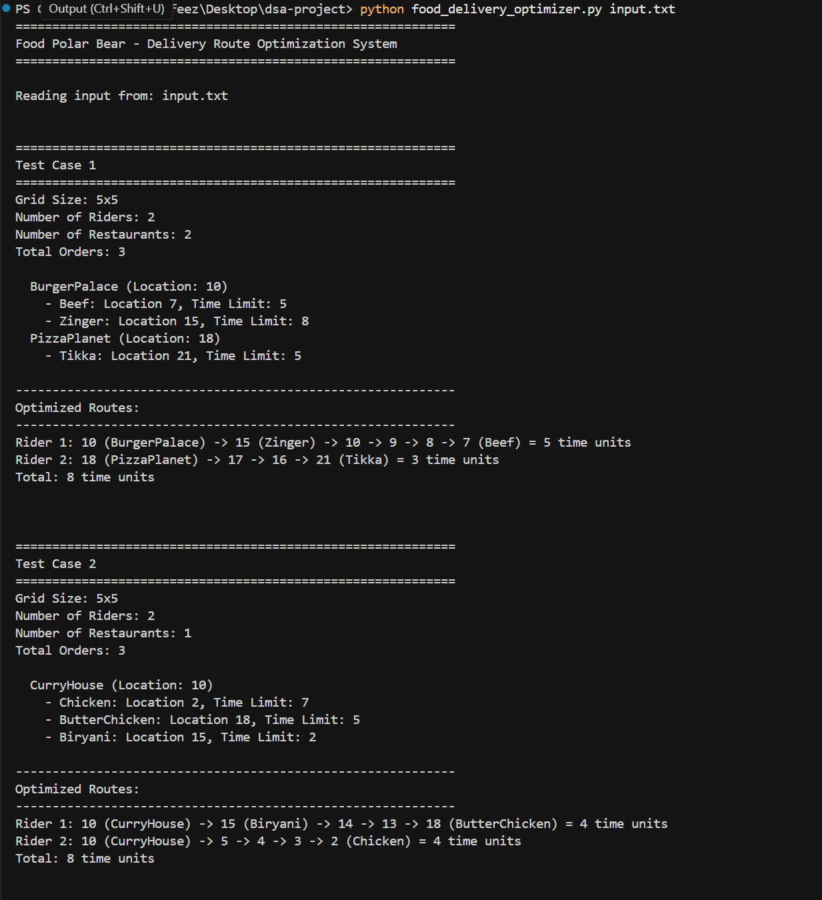
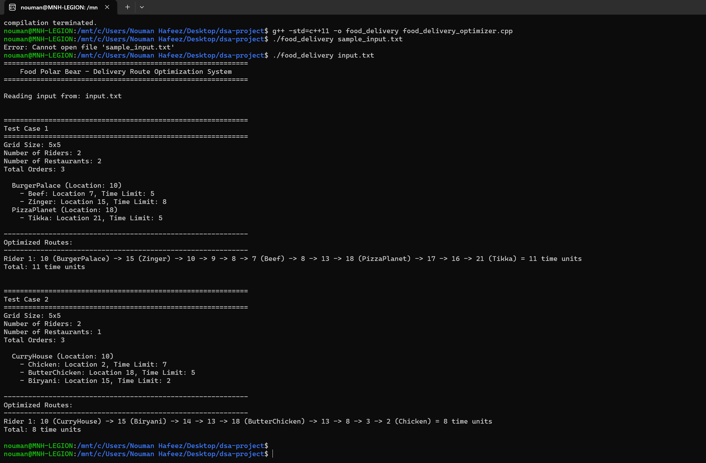
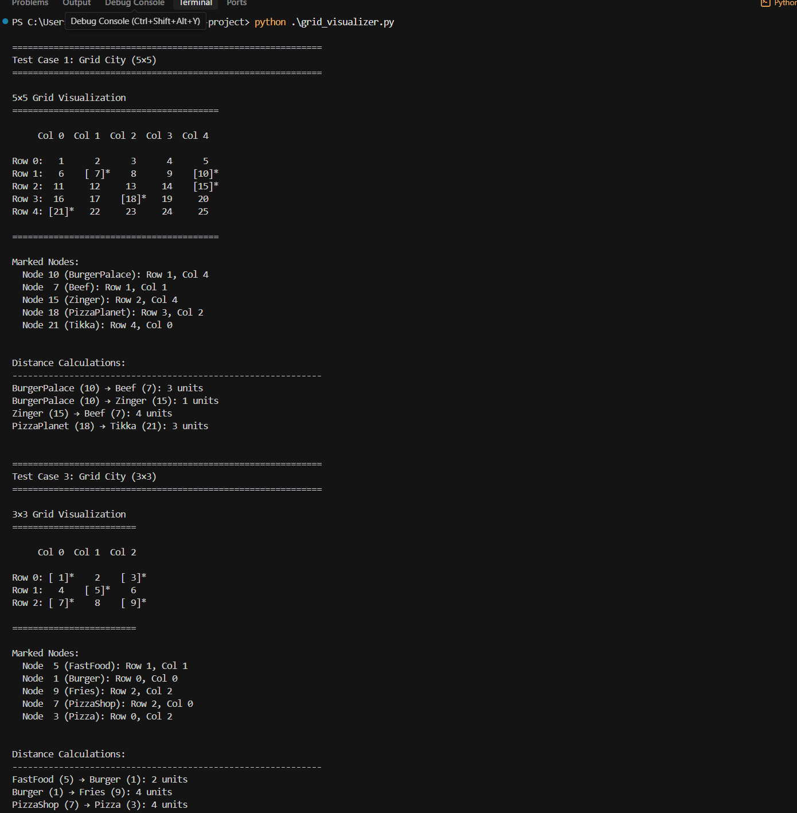

# Food Polar Bear - Delivery Route Optimization System

## Project Overview
This project implements a route optimization algorithm for a food delivery service operating in Grid City. The system efficiently assigns delivery orders to multiple riders while minimizing total travel time and respecting delivery time constraints.

**Implementations:** The project includes two implementations of the same algorithm:
- **Python** (`food_delivery_optimizer.py`) – run with Python 3.6+
- **C++** (`food_delivery_optimizer.cpp`) – compile and run with a C++ compiler (e.g. g++ on Linux/WSL, or MSVC on Windows)

Sample run screenshots (WSL):
- **`output_python_run_wsl.png`** – Python implementation
- **`output_cpp_run_wsl.png`** – C++ implementation  
- **`output_grid_visualizer.png`** – Grid visualization tool

## Problem Description
Grid City is represented as an N×N grid where:
- Nodes are numbered from 1 to N², going left to right, top to bottom
- Each node can contain restaurants or customer locations
- Edges represent road connections between adjacent nodes
- Each edge takes 1 unit of time to travel
- Multiple riders must deliver orders from restaurants to customers
- Each order has a time constraint (maximum delivery time from restaurant to customer)

## Algorithm & Data Structures

### 1. Graph Representation (Graph Class)
**Data Structure**: Adjacency List using `defaultdict`
- **Time Complexity**: O(N²) for construction
- **Space Complexity**: O(N²)
- **Rationale**: Adjacency list is efficient for sparse graphs like grids where each node has at most 4 neighbors

**Key Methods**:
- `shortest_path_distance(start, end)`: Uses BFS to find shortest path
  - **Time Complexity**: O(V + E) = O(N²) where V = N² vertices
  - **Rationale**: Since all edges have weight 1, BFS is optimal (simpler and faster than Dijkstra's)

### 2. Route Optimization (RouteOptimizer Class)
**Algorithm**: Greedy Assignment with Nearest Neighbor Heuristic

**Phase 1: Order Assignment**
- Sort orders by time limit (ascending) to prioritize urgent deliveries
- For each order, find the best rider who can complete it with minimum additional time
- **Time Complexity**: O(R × O × I) where R = restaurants, O = orders, I = riders
- **Rationale**: Ensures urgent orders are assigned first and balanced load across riders

**Phase 2: Route Construction**
- Group orders by restaurant for each rider
- Use nearest neighbor heuristic to visit restaurants
- From each restaurant, deliver orders using nearest neighbor
- **Time Complexity**: O(O² × N²) per rider in worst case
- **Rationale**: Greedy nearest neighbor is a good heuristic for TSP-like problems with reasonable results and polynomial time

### 3. Input Parsing (InputParser Class)
**Data Structure**: Sequential parsing with validation
- **Time Complexity**: O(total input size)
- **Error Handling**: Validates grid bounds, positive values, file existence

## Solution Approach

The implemented solution uses a **Greedy Assignment with Local Optimization** strategy:

1. **Priority-based Assignment**: Orders with tighter time constraints are assigned first
2. **Load Balancing**: Each order is assigned to the rider who can complete it with minimum additional time
3. **Route Optimization**: For each rider, orders are grouped by restaurant and delivered using nearest neighbor heuristic
4. **Feasibility Checking**: Orders are only assigned if they can be delivered within time limits

### Why This Approach?

**Advantages**:
- ✅ Polynomial time complexity (efficient for large inputs)
- ✅ Balances load across multiple riders
- ✅ Respects time constraints
- ✅ Produces good-quality solutions (near-optimal in many cases)
- ✅ Handles edge cases gracefully

**Limitations**:
- Not guaranteed to find the absolute optimal solution (VRP is NP-hard)
- Greedy choices may not always be globally optimal

**Alternative Approaches Considered**:
1. **Exact Algorithms** (Branch & Bound, Dynamic Programming): Too slow for large instances
2. **Metaheuristics** (Genetic Algorithm, Simulated Annealing): Higher complexity, may be overkill
3. **Mixed Integer Programming**: Requires external solver libraries

## File Structure

```
food-delivery-optimizer/
│
├── food_delivery_optimizer.py    # Main program (Python)
├── food_delivery_optimizer.cpp   # Main program (C++)
├── output_python_run_wsl.png    # Screenshot of Python run on WSL
├── output_cpp_run_wsl.png       # Screenshot of C++ run on WSL
├── output_grid_visualizer.png   # Screenshot of grid visualizer on WSL
├── grid_visualizer.py            # Visualization/debugging helper (optional; run separately)
├── input.txt                     # Sample input file
├── test_input.txt                # Additional test cases
├── README.md                     # This file
├── QUICKSTART.md                 # Quick start guide
├── PROJECT_REPORT.md             # Project report
├── Project Description.pdf       # Project specification
└── algorithm_explanation.pdf     # Detailed algorithm documentation (if present)
```

## Input Format

```
<number_of_test_cases>

For each test case:
<grid_size> <num_riders> <num_restaurants>

For each restaurant:
<restaurant_name> <location> <num_orders>
<order_name> <location> <time_limit>
<order_name> <location> <time_limit>
...
```

### Example Input:
```
2
5 2 2
BurgerPalace 10 2
Beef 7 5
Zinger 15 8
PizzaPlanet 18 1
Tikka 21 5
5 2 1
CurryHouse 10 3
Chicken 2 7
ButterChicken 18 5
Biryani 15 2
```

## Output Format

For each test case:
- Test case header with grid size, riders, and restaurants
- List of all restaurants and their orders
- Optimized routes for each rider showing: start location -> delivery locations
- Time taken by each rider
- Total time (sum of all rider times)

## Usage

### Python
```bash
python food_delivery_optimizer.py input.txt
```

### C++
Compile (e.g. with g++ on Linux/WSL):
```bash
g++ -o food_delivery_optimizer food_delivery_optimizer.cpp
./food_delivery_optimizer input.txt
```

On Windows (Visual Studio / MSVC), build the project and run from the command line with the input file as argument.

### Command Line Arguments
- Both implementations take the input file path as the first (and only) argument (e.g. `input.txt`).

### Run screenshots (WSL)
Sample output from the Python implementation:



Sample output from the C++ implementation:



Sample output from the grid visualization tool:



### Example Output:
```
============================================================
Food Polar Bear - Delivery Route Optimization System
============================================================

Reading input from: input.txt

============================================================
Test Case 1
============================================================
Grid Size: 5x5
Number of Riders: 2
Number of Restaurants: 2
Total Orders: 3

  BurgerPalace (Location: 10)
    - Beef: Location 7, Time Limit: 5
    - Zinger: Location 15, Time Limit: 8
  PizzaPlanet (Location: 18)
    - Tikka: Location 21, Time Limit: 5

------------------------------------------------------------
Optimized Routes:
------------------------------------------------------------
Rider 1: 10 (BurgerPalace) -> 15 (Zinger) -> 7 (Beef) = 5 time units
Rider 2: 18 (PizzaPlanet) -> 21 (Tikka) = 3 time units
Total: 8 time units
```

## Code Organization

### Classes:

1. **Graph**: Manages grid representation and shortest path calculations
2. **Order**: Represents a delivery order with location and time constraint
3. **Restaurant**: Represents a restaurant with location and associated orders
4. **RouteOptimizer**: Core optimization logic for route planning
5. **InputParser**: Handles input file parsing and validation

### Key Functions:

- `_build_grid_graph()`: Constructs adjacency list for grid
- `shortest_path_distance()`: BFS-based shortest path
- `optimize_routes()`: Main optimization algorithm
- `_find_best_rider()`: Assigns order to best available rider
- `_build_route_for_rider()`: Constructs optimal route for a rider
- `parse_input()`: Parses and validates input file

## Error Handling

The program handles various error scenarios:

✅ **File Not Found**: Clear error message with file path  
✅ **Invalid Input Format**: Line-by-line validation with error reporting  
✅ **Out of Bounds**: Validates location against grid size  
✅ **Negative Values**: Checks for positive grid size, riders, time limits  
✅ **Incomplete Data**: Detects missing restaurant/order data  
✅ **Empty Files**: Handles empty input gracefully  

## Testing

### Test Case 1 (Example from Problem):
- 5×5 grid, 2 riders, 2 restaurants
- BurgerPalace (10): 2 orders
- PizzaPlanet (18): 1 order
- Expected: Efficient distribution across 2 riders

### Test Case 2:
- 5×5 grid, 2 riders, 1 restaurant
- CurryHouse (10): 3 orders with varying time constraints
- Tests load balancing from single restaurant

### Additional Test Scenarios:
- Single rider with multiple restaurants
- Large grid (10×10) with many orders
- Tight time constraints
- Orders at grid boundaries

## Time & Space Complexity Analysis

### Overall Time Complexity:
- Graph Construction: O(N²)
- Input Parsing: O(R × O) where R = restaurants, O = orders
- Route Optimization: O(I × R × O × N²) where I = riders
- **Total**: O(I × R × O × N²)

### Space Complexity:
- Graph Storage: O(N²)
- Orders & Restaurants: O(R + O)
- Routes Storage: O(I × O)
- **Total**: O(N² + R + O + I×O)

### Efficiency Notes:
- BFS is optimal for unweighted graphs
- Greedy approach avoids exponential complexity of exact VRP solutions
- Adjacency list is memory-efficient for sparse graphs
- No redundant distance calculations (could add memoization for further optimization)

## Shortcomings & Improvements

**Fixes already applied:** (1) Total time is computed as the **sum** of all rider times (not max), per the spec example (Rider 1: 5, Rider 2: 3 → Total: 8). (2) Route output uses ASCII `" -> "` instead of Unicode arrow so it runs correctly on Windows and all consoles.

The following shortcomings have been identified; addressing them would improve correctness, robustness, and efficiency.

### Correctness & Solution

- **Time constraint uses direct distance only**: Time limits are checked using shortest path from restaurant to customer. On the actual route (e.g. restaurant → customer A → customer B), elapsed time to B can exceed the direct distance. *Improvement:* In route building, track elapsed time from each restaurant to each delivery and ensure it stays within the order’s time limit; reject or reorder if not.
- **Rider assignment and total time**: During assignment, `route_times` are not updated until all orders are assigned, so “additional time” is not computed from current loads. *Improvement:* After each assignment, recompute current route times and pass them into the best-rider logic so assignment minimizes true additional time and improves load balance.
- **First restaurant chosen arbitrarily**: When the rider has no current location, the first restaurant in the list is used. *Improvement:* Use a heuristic (e.g. most orders, or try each restaurant as first and pick the best) to reduce total route time.

### Robustness & Output

- **Unassigned orders not reported**: If no rider can deliver an order within its time limit, the order is skipped with no message. *Improvement:* Collect unassigned orders and print a warning (e.g. “X order(s) could not be delivered within time limit”) and optionally “Delivered: Y / Total: Z orders.”
- **Output format**: The spec example shows intermediate path nodes (e.g. 10 → 15 → 14 → 13 → 12 → 7); the code prints only stops. *Improvement (optional):* Store and print the full path between stops for each rider.
- **Parser calls `sys.exit(1)`**: Errors in `parse_input` exit the process directly, making the parser hard to reuse or test. *Improvement:* Raise exceptions and let `main()` catch them, print a message, and exit.

### Efficiency

- **Repeated BFS for distance**: Shortest path is computed with BFS for many pairs. On a grid, distance equals Manhattan distance (O(1)). *Improvement:* Add a `manhattan_distance(a, b)` helper and use it for distance-only queries to reduce work and scale better.

### Other

- **No unit tests**: Add tests for graph (node numbering, distances), parser (valid/invalid input), and optimizer (known total time) to reduce regression risk.
- **`grid_visualizer.py`**: Standalone helper for debugging; not used by the main program. Document in README that it is for visualization/debugging; optionally support a `--visualize` flag.

## Potential Improvements (Future Work)

1. **Distance Memoization**: Cache shortest path distances (or use Manhattan) to avoid recalculation
2. **Better Initial Assignment**: Use current route times during assignment; consider Hungarian algorithm for rider-order matching
3. **Local Search**: Add 2-opt or 3-opt route improvement after greedy construction
4. **Parallel Processing**: Process multiple test cases in parallel
5. **Heuristic Tuning**: Weight time constraints more heavily in assignment
6. **Dynamic Rider Count**: Allow algorithm to suggest optimal rider count

## Requirements

**Python implementation**
- Python 3.6+
- Standard library only (no external dependencies)

**C++ implementation**
- C++ compiler (e.g. g++, clang++, or MSVC)
- C++11 or later; standard library only

## Author Notes

This implementation prioritizes:
1. **Correctness**: Handles all edge cases and constraints
2. **Clarity**: Well-documented code with clear algorithmic choices
3. **Efficiency**: Polynomial time with reasonable practical performance
4. **Robustness**: Comprehensive error handling and validation

The greedy nearest-neighbor approach with priority-based assignment provides a good balance between solution quality and computational efficiency for this vehicle routing problem variant.
